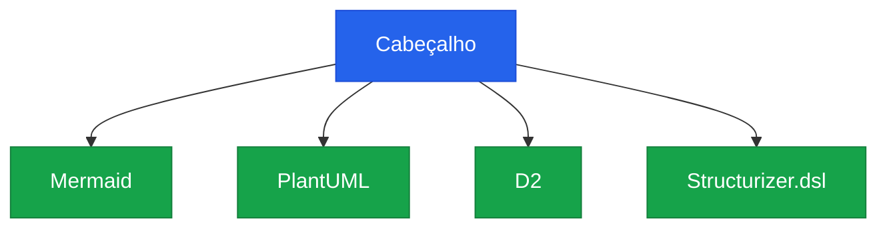

# Readme
### Nesse readme está a estrutura principal dos documentos

```mermaid
flowchart TD
    A["Cabeçalho"] --> B["Mermaid"]
    A --> C["PlantUML"]
    A --> D["D2"]
    A --> E["Structurizer.dsl"]

    style A fill:#2563eb,color:#ffffff,stroke:#1d4ed8
    style B fill:#16a34a,color:#ffffff,stroke:#15803d
    style C fill:#16a34a,color:#ffffff,stroke:#15803d
    style D fill:#16a34a,color:#ffffff,stroke:#15803d
    style E fill:#16a34a,color:#ffffff,stroke:#15803d
```
